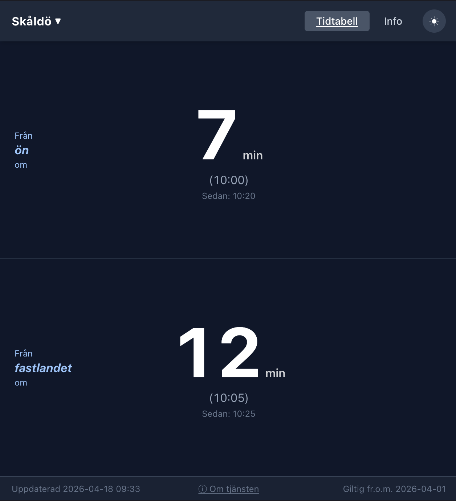
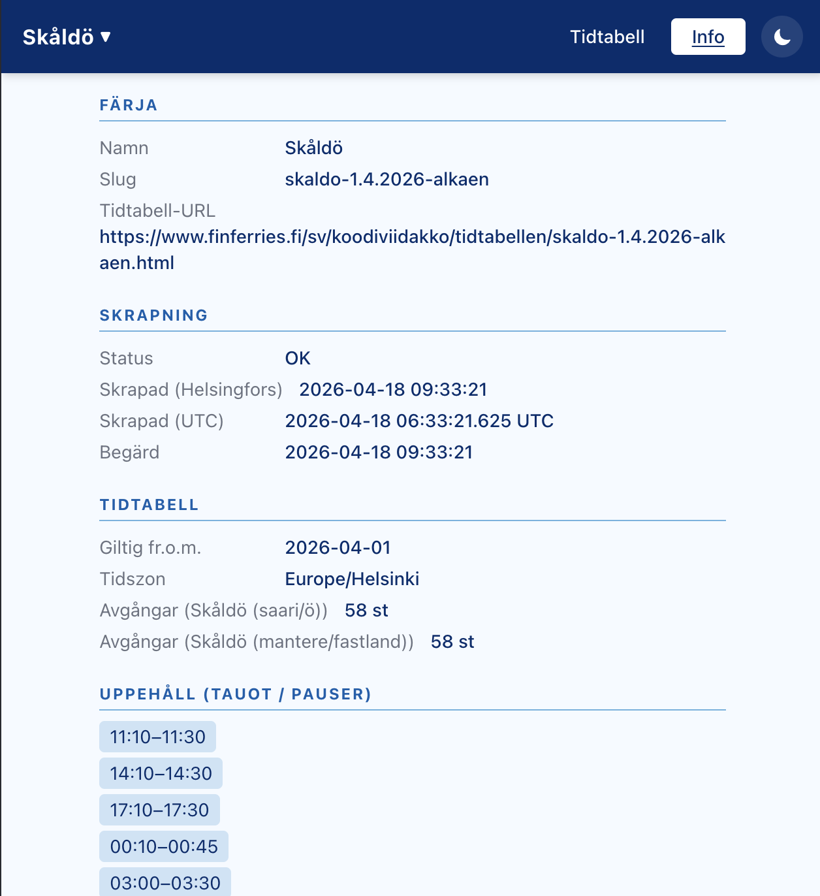

# Färjan

🌐 **Live site: [farjan.lagus.net](https://farjan.lagus.net/)**

Self-hosted ferry timetable checker for all Finnish public ferries. Scrapes [finferries.fi](https://www.finferries.fi), caches timetables locally, and shows a live departure countdown for any available ferry route.

<p align="center">
  
  &nbsp;
  
</p>

> **Keywords:** Finnish ferry timetable · Finferries · Skåldö · Skärgård · färjetrafik · färja tidtabell · lauttaaikataulu · saaristoliikenteen aikataulu · self-hosted · open source · departure countdown · React · Docker · Node.js

---

## Table of contents

- [Färjan](#färjan)
  - [Table of contents](#table-of-contents)
  - [Quick start](#quick-start)
  - [Features](#features)
  - [Configuration](#configuration)
  - [Persistent data](#persistent-data)
  - [Disclaimer](#disclaimer)
  - [Docs](#docs)
  - [På svenska](#på-svenska)
  - [Suomeksi](#suomeksi)

---

## Quick start

```bash
./rebuild.sh
```

Opens at **http://localhost:3000**. The script stops any existing container, builds a fresh image, and starts it with persistent storage at `./data`.

> Requires Docker. See the [Development guide](docs/development.md) for running without Docker.

---

## Features

- Live countdown to next departure (switches to seconds in the final minute, urgency colours)
- All Finnish public ferries selectable via dropdown — timetables loaded on demand and cached
- Break periods shown with the next departure after the break
- Weekday / weekend variants auto-selected based on current day
- Dark and light theme, persisted in `localStorage`
- Mobile-first horizontal layout optimised for one-handed use
- SVG favicon — MDI ferry icon in navy and mint
- Ferry registry rebuilt weekly; individual timetables cached 24 h

---

## Configuration

| Variable           | Default           | Description                                                                          |
|--------------------|-------------------|--------------------------------------------------------------------------------------|
| `PORT`             | `3000`            | HTTP port the server listens on                                                      |
| `DATA_DIR`         | `/data`           | Path to the persistent data volume                                                   |
| `TZ`               | `Europe/Helsinki` | Timezone used by the cron scheduler                                                  |
| `ANALYTICS_TOKEN`  | _(unset)_         | Secret token to access the analytics dashboard; if unset, analytics API is disabled  |
| `LOG_ANALYTICS`    | `true`            | Set to `false` to disable event recording entirely                                   |

Set variables in `docker-compose.yml` or pass them to `rebuild.sh` / `docker run -e`.

```bash
PORT=8080 ./rebuild.sh

# Enable the analytics dashboard
ANALYTICS_TOKEN=your-strong-secret ./rebuild.sh

# Disable analytics event recording
LOG_ANALYTICS=false ./rebuild.sh
```

---

## Persistent data

All state lives in `./data` (bind-mounted into the container at `/data`).

| File | Updated | Description |
|------|---------|-------------|
| `timetable.json` | Daily 01:07 | Skåldö timetable (legacy, kept for compatibility) |
| `ferries.json` | Monday 01:15 | Registry of all verified ferry routes |
| `timetables/<slug>.json` | On first request, then every 24 h | Per-ferry timetable cache |
| `analytics.jsonl` | On every page/ferry request | Hashed-IP analytics events (rotated weekly, 90-day retention) |

The container is stateless — delete any file to force a fresh scrape on next startup or request.

---

## Analytics dashboard

When `ANALYTICS_TOKEN` is set, a private analytics dashboard becomes available at `/analytics`. It is not linked from the public UI.

**Enable it:**
```bash
ANALYTICS_TOKEN=your-strong-secret ./rebuild.sh
```

Or uncomment the relevant line in `docker-compose.yml` and set `ANALYTICS_TOKEN` in your shell or `.env` file.

**Access it:**
Navigate to `http://localhost:3000/analytics` and enter the token. The session is stored in `sessionStorage` (clears when the browser tab is closed).

**Privacy:**
- Only hashed (SHA-256) IP addresses are stored — never raw IPs.
- No cookies, no third-party scripts, no external calls.
- To disable recording entirely, set `LOG_ANALYTICS=false`.

---

## Disclaimer

This project is an **independent, non-commercial tool** with no affiliation to [Finferries](https://www.finferries.fi) or Traficom. Timetable data is scraped from finferries.fi and may contain errors. Always verify departure times through official sources before travelling.

Developed entirely by AI — [Claude (claude-sonnet-4-6)](https://www.anthropic.com) by Anthropic, using [Claude Code](https://claude.ai/code).

Source: [github.com/Nornode/farjan](https://github.com/Nornode/farjan)

---

## Docs

- [API reference](docs/api.md)
- [Development guide](docs/development.md)

---

## På svenska

**Färjan** är ett självhostat tidtabellsverktyg för alla Finlands offentliga färjor. Applikationen hämtar tidtabellsdata automatiskt från [finferries.fi](https://www.finferries.fi), sparar den lokalt i en cache och visar en realtidsnedräkning till nästa avgång för den valda färjerutten.

**Centrala funktioner:**
- Alla Finferries-färjor valbara via rullgardinsmeny
- Nedräkning till nästa avgång, sekunders precision i sista minuten
- Uppehåll och avvikelser visas automatiskt
- Vardag- och veckoslutstidtabeller väljs automatiskt baserat på dag
- Mörkt och ljust tema

**Sökord:** `färja tidtabell` · `Finferries` · `Skåldö` · `skärgårdstrafik` · `färjetur` · `färjeapp` · `Docker` · `React` · `självhostad tjänst` · `färjeöverfart` · `Traficom`

---

## Suomeksi

**Färjan** on itseisännöity aikataululukija Suomen julkisille lautoille. Sovellus hakee aikataulutiedot automaattisesti [finferries.fi](https://www.finferries.fi)-sivustolta, tallentaa ne paikallisesti välimuistiin ja näyttää reaaliaikaisen lähtölaskennan valitulle lauttareitille.

**Keskeiset ominaisuudet:**
- Kaikki Finferries-lautat valittavissa pudotusvalikosta
- Seuraavaan lähtöön lasketaan aika sekunnin tarkkuudella
- Tauot ja poikkeusajat näytetään automaattisesti
- Arki- ja viikonloppuaikataulut valitaan päivän mukaan
- Tumma ja vaalea teema

**Hakusanat:** `lautta-aikataulu` · `Finferries` · `Skåldö` · `saaristoliikenteen aikataulu` · `lauttayhteys` · `lautta-app` · `Docker` · `React` · `itseisännöity palvelu` · `lossiyhteys` · `Traficom`
